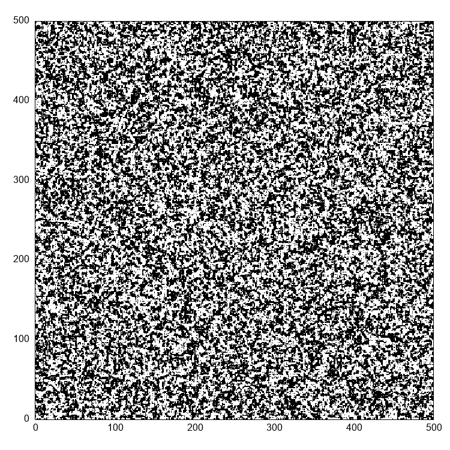
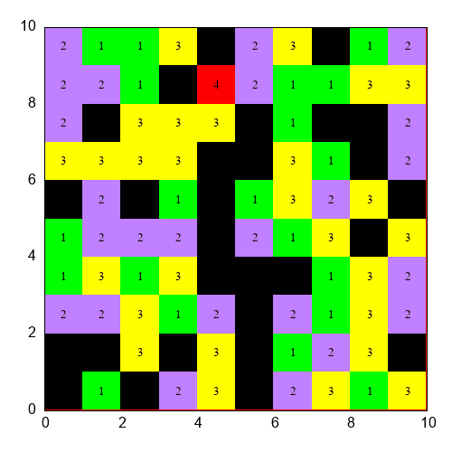
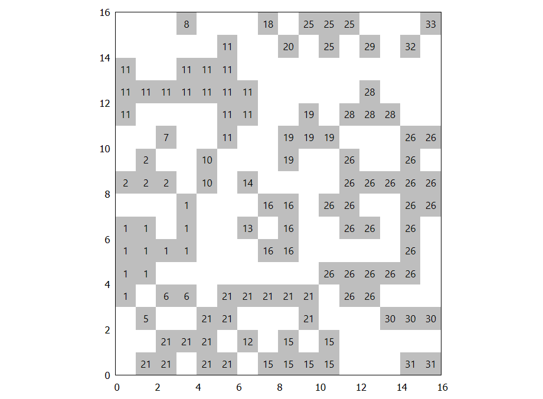
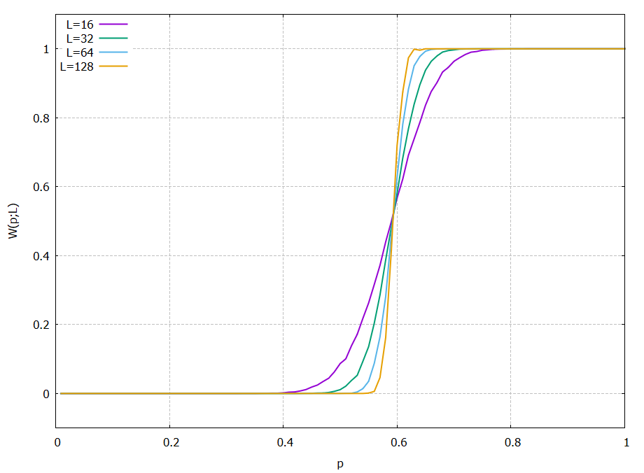

# Rust Numerical Examples

A few numerical problems/models solved using Rust and visualized with Gnuplot. Each problem has its own directory. 
Examples of results and visualizations are shown below, in separate sections.

### Technologies used

- Programming language: Rust

   Crates: [ndarray](https://github.com/rust-ndarray/ndarray "ndarray github"), [rand](https://github.com/rust-random/rand "rand github"), std::collections, utilities.rs - own functions for easy saving arrays in gnuplot format

- Visualizations tool: Gnuplot

## Ising model in 2D

Consider Ising model in two dimensions, which is a model of ferromagnetism. Here its represented as square lattice of spins, which can have values -1 or 1. See
[Wiki](https://en.wikipedia.org/wiki/Ising_model#Monte_Carlo_methods_for_numerical_simulation "Ising model wikipedia page") for more information on this model.

### Visualization
Low temperature system evolution, 500x500 lattice.

## Self organized criticality(SOC) - sandpile model

There exists a wide field of systems which exhibit SOC, and one of them is a sandpile model, refered to as [Abelian sandpile model](https://en.wikipedia.org/wiki/Abelian_sandpile_model).

Grains are dropped in random lattice spaces and whenever 4 grains are stacked on a single cell, this cell collapses transferring sand into adjacent sites. 
Such grain drops can cause a cascade, and thats exactly what happens below.

## Percolations

The purpose of this project was to determine percolation probability on square lattice. The main coding part was to implement Hoshen–Kopelman algorithm for cluster finding.
It was done using this [wiki](https://en.wikipedia.org/wiki/Hoshen–Kopelman_algorithm) page.

In the picture below one can see labeled clusters for lattice generated with probability of occupation p=0.4

How the probability of percolation looks in function of parameter p, for size of lattice = L

